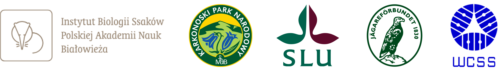

<p align="center">
  
</p>

<div align="center"> 
<font size="6"> GUI application for creating camera trapping data packages </font>
<br>
<hr> 


<a href="https://demo.trapper-project.org/"></a>
<a href="https://trapper-client.readthedocs.io/en/latest/"></a>
<a href="https://besjournals.onlinelibrary.wiley.com/doi/10.1111/2041-210X.12571"></a>
<a href="https://join.slack.com/t/trapperproject/shared_invite/zt-2f360a5pu-CzsIqJ6Y~iCa_dmGXVNB7A"></a>
<a href="https://gitlab.com/trapper-project/trapper/-/blob/master/LICENSE"></a>
<br><br>
</div>

## Table of Contents

[Overview](https://gitlab.com/oscf/trapper-client#-overview) |
[Installation](https://gitlab.com/oscf/trapper-client#-installation) |
[Documentation](https://gitlab.com/oscf/trapper-client#-documentation) | 
[Who is using TRAPPER?](https://gitlab.com/oscf/trapper-client#-who-is-using-trapper) | 
[Funders and Partners](https://gitlab.com/oscf/trapper-client#-funders-and-partners) | 
[Support](https://gitlab.com/oscf/trapper-client#-support) | 
[License](https://gitlab.com/oscf/trapper-client#-license)

## 🫎 Overview

**Trapper Client** is a [Kivy](https://kivy.org/) application written in [Python](https://www.python.org/) designed to assist in creating camera trapping data packages compatible with the [TRAPPER](https://gitlab.com/oscf/trapper-project) system, an open-source web-based application for managing camera trapping projects. You can use trapper-client to communicate directly with TRAPPER, organizing pictures and videos recorded by your camera traps into structured data packages and uploading them to the TRAPPER server. The app includes tools to facilitate the processing of large collections of raw camera trapping data. With this app, you can:

* **CONVERT**: Convert raw video files (e.g., AVI) into web-friendly video formats (e.g., mp4, webm).

* **PACKAGE**: Generate data packages which are .zip files accompanied by package definition files (YAML). These packages are further used by TRAPPER to automatically link uploaded files to corresponding deployments and update the database with the primary metadata of the records.

* **UPLOAD**: Upload data packages to a server via the FTP(S) protocol. Uploaded data packages are placed on a server in a dedicated directory associated with a TRAPPER user profile.

To set up the entire process properly, all raw camera trapping data should be stored in one directory (e.g., project) with collections of recorded files (e.g., recording sessions) as its sub-directories. Each collection can have another level of sub-directories that aggregate data into deployments (e.g., an array of camera traps deployed during a session). The names of these directories should correspond to the codes of the deployments as defined in the TRAPPER database.

## 📥 Installation

```bash
$ git clone https://gitlab.com/oscf/trapper-client.git
$ cd trapper-client
$ git checkout -b develop
$ git pull origin develop
$ python3 -m venv env
$ source ./env/bin/activate
$ pip install -r reqs.txt
$ garden install filebrowser --kivy
```

and finally:

```bash
$ python3 ./main.py
```

## 📝 Documentation

[TRAPPER](https://trapper-project.readthedocs.io) and [Trapper Client](https://trapper-client.readthedocs.io/en/latest/) documentation.

If you are using TRAPPER, please cite our work:

> Bubnicki, J.W., Churski, M. and Kuijper, D.P.J. (2016), trapper: an open source web-based application to manage camera trapping projects. Methods Ecol Evol, 7: 1209-1216. https://doi.org/10.1111/2041-210X.12571

For more news about TRAPPER please visit the [Open Science Conservation Fund (OSCF) website](https://os-conservation.org) and [OSCF LinkedIn profile](https://www.linkedin.com/company/os-conservation/).

## 🏢 Who is using TRAPPER?
* Mammal Research Institute Polish Academy of Sciences;
* Karkonosze National Park;
* Swedish University of Agricultural Sciences;
* Svenska Jägareförbundet;
* Meles Wildbiologie;
* University of Freiburg Wildlife Ecology and Management;
* Bavarian Forest National Park;
* Georg-August-Universität Göttingen;
* KORA - Carnivore Ecology and Wildlife Management;
* and many more individual scientists and ecologies;

## 💲 Funders and Partners
<p align="center">
  
</p>
<p align="center">
  
</p>

## 🤝 Support

Feel free to add a new issue with a respective title and description on the [TRAPPER issue tracker](https://gitlab.com/trapper-project/trapper/-/issues). If you already found a solution to your problem, we would be happy to review your pull request.

If you prefer direct contact, please let us know: `contact@os-conservation.org`

We also have [TRAPPER Mailing List](https://groups.google.com/d/forum/trapper-project) and [TRAPPER Slack](https://join.slack.com/t/trapperproject/shared_invite/zt-2f360a5pu-CzsIqJ6Y~iCa_dmGXVNB7A).

## 📜 License

Read more in [TRAPPER License](https://gitlab.com/oscf/trapper-client/-/blob/master/LICENSE).