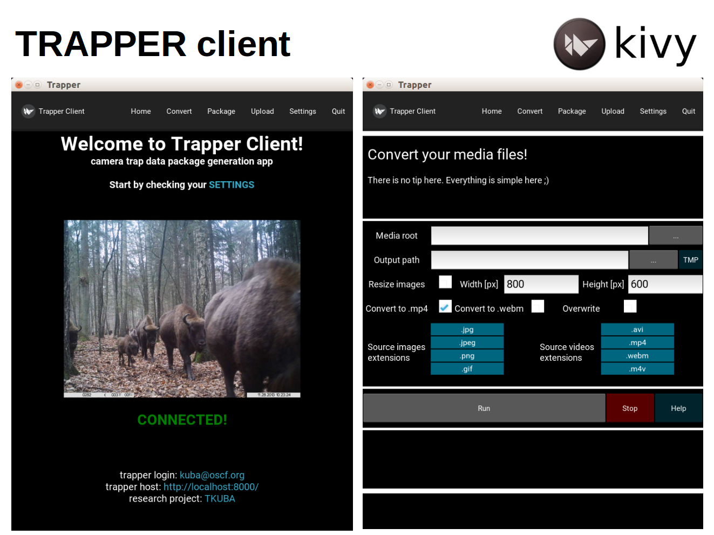

==========
 Overview
==========

**trapper-client** is a `kivy <https://kivy.org/>`_ application written in `Python3 <https://www.python.org/>`_ which helps with creating camera trapping data packages compatible with `TRAPPER <https://gitlab.com/oscf/trapper-project>`_ system, an open source web-based application to manage camera trapping projects. You can use **trapper-client** to communicate with TRAPPER directly, i.e. to organize pictures and videos recorded by your camera traps into structured data packages and to upload them to TRAPPER server.

The app contains tools that facilitate processing of large collections of raw camera trapping data. Using this app you can:

**CONVERT**: convert raw video files (e.g. AVI) into one of web-friendly video formats (e.g. mp4, webm)

**PACKAGE**: generate data packages which are .zip files with accompanying package definition files (YAML); these packages are further used by TRAPPER to automatically link uploaded files to corresponding deployments and to update database with records primary metadata

**UPLOAD**: upload data packages to a server via FTP protocol; uploaded data packages are placed on a server in a dedicated directory associated with a TRAPPER's user profile

To setup the entire process properly all raw camera trapping data should be stored in one directory (e.g. project) with collections of recorded files (e.g. recording sessions) as its sub-directories. Each collection can have another level of sub-directories aggregating data into deployments (e.g. an array of camera traps deployed during a session) with names of these directories corresponding to codes of deployments as defined in TRAPPER database.

The expected structure of multimedia files and sub-directories in the root (project) directory is as follows:

.. code-block:: python
                
    |- collection_name_1
    |   |- deployment_id_1
    |      |- filename_1
    |      |- filename_2
    |      |- filename_3
    |      |- filename_4
    |   |- deployment_id_2
    |      |- filename_1
    |      |- filename_2
    |      |- filename_3
    |      |- filename_4
    |   |- ...
    |- collection_name_2
    |   |- deployment_id_3
    |      |- ...
    |   |- ...
    |- ...

**TRAPPER gitlab repository:**

`<https://gitlab.com/oscf/trapper-project>`_

**TRAPPER Demo:**

`<https://demo.trapper-project.org>`_

**Read more about TRAPPER:**

Bubnicki, J. W., Churski, M. and Kuijper, D. P. (2016), TRAPPER: an open source web‐based application to manage camera trapping projects. Methods Ecol Evol, 7: 1209-1216. doi:10.1111/2041-210X.12571

`<https://besjournals.onlinelibrary.wiley.com/doi/10.1111/2041-210X.12571>`_

For more news about TRAPPER please visit the Open Science Conservation Fund (OSCF) website:

`<https://os-conservation.org>`_
